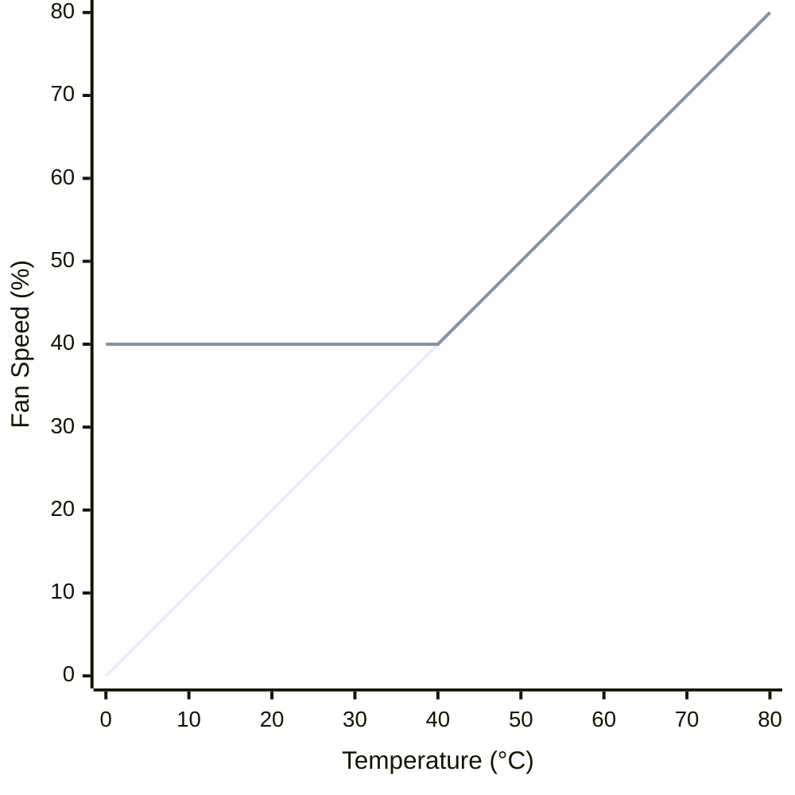

# nvidia-fan-controller
basic script to create a linear fan curve for nvidia gpu's and have it run at login

## Requirements
* Linux
* nVidia GPU
* nVidia nonfree drivers

## tl;dr
* Run the command below in `Step 3` and seek help elsewhere if you get an error
* Read the instructions below starting at `Step 7`


## Instructions

1) Run the following command to open the NVIDIA Settings GUI.
```
nvidia-settings
```
2) Under the Thermal Settings section for a GPU you should be able to click the Enable GPU Fan Settings button, move the fan speed sliders and apply the new speed. If the Apply button or checkbox is greyed out for you, that's beyond the scope of this project.
3) Run the following command to set the fan speed to 100% and listen for increased noise.
```
nvidia-settings -a "GPUFanControlState=1"; nvidia-settings -a "GPUTargetFanSpeed=100"
```
4) Run the command again with a slightly reduced fan speed until you hear the fans getting quieter. Once you find it, that will be your max fan speed. For me it's 80%. This is a linear fan "curve". If my max is 80% then image the fan speed (%) below shooting straight up to 100% fan speed instead of 80%

5) Run the above command again to find your min fan speed as shown in the above chart. Start at 0% fan speed and slowly work your way up. For me this number is 40%
6) Edit the `nvidia-fan-controller.sh` file entering your min and max fan values from above. The defaults are my settings. delay is the amount of milliseconds added between updates.
7) Move `nvidia-fan-controller.sh` where you like. Some suggestions:
```
$HOME/.local/share/nvidia-fan-controller/nvidia-fan-controller.sh
$XDG_DATA_HOME/nvidia-fan-controller/nvidia-fan-controller.sh
```
8) Make `nvidia-fan-controller.sh` executable
```
chmod u+x nvidia-fan-controller.sh
```
9) Edit `nvidia-fan-controller.service` verifying ExecStart points to `nvidia-fan-controller.sh`, Move the file to:
```
$HOME/.config/systemd/user/nvidia-fan-controller.service
```
10) Setup the user service
```
systemctl --user enable nvidia-fan-controller
systemctl --user start nvidia-fan-controller
```
11) Monitor for errors
```
watch systemctl --user status nvidia-fan-controller
```
12) Uninstallation
```
systemctl --user stop nvidia-fan-controller
systemctl --user disable nvidia-fan-controller
#remove the nvidia-fan-controller.service and nvidia-fan-controller.sh file
```